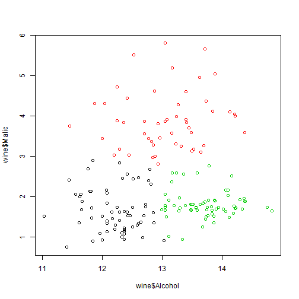

## About the dataset

### Description

The wine dataset contains the results of a chemical analysis of wines grown in a specific area of Italy. Three types of wine are represented in the 178 samples, with the results of 13 chemical analyses recorded for each sample. The Type variable has been transformed into a categoric variable.

The data contains no missing values and consits of only numeric data, with a three class target variable (Type) for classification.

--- .class #id 

## Application

Refer to https://jasmine-ng.shinyapps.io/shiny_app/ for the application

Show the scatter plot of 2 variables based on your input.
Also compute k-means clustering on the 2 variables.

--- .class #id

#### An Example


```r
cl <- kmeans(wine[,2:3],3)
plot(wine$Alcohol,wine$Malic,col = cl$cluster)
```

 

--- .class #id

# THE END
